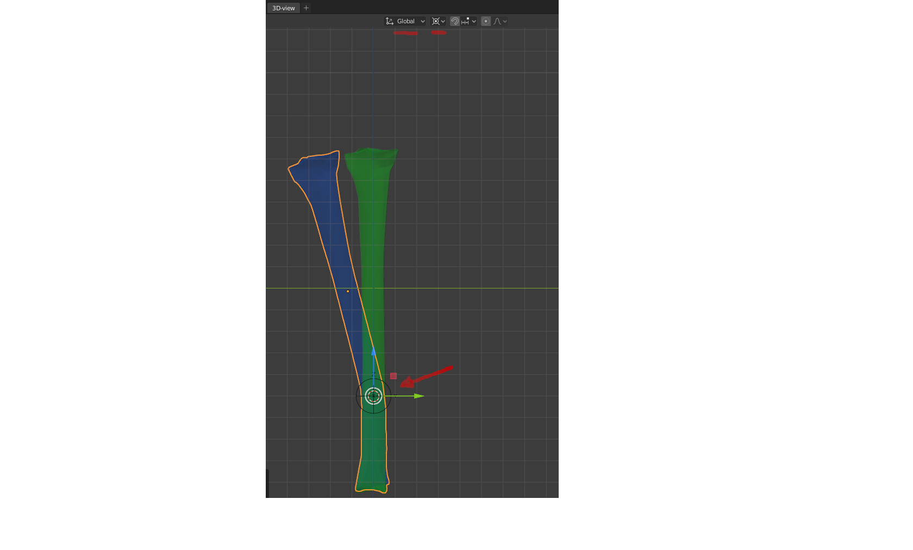
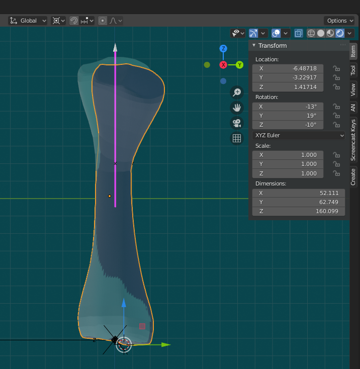
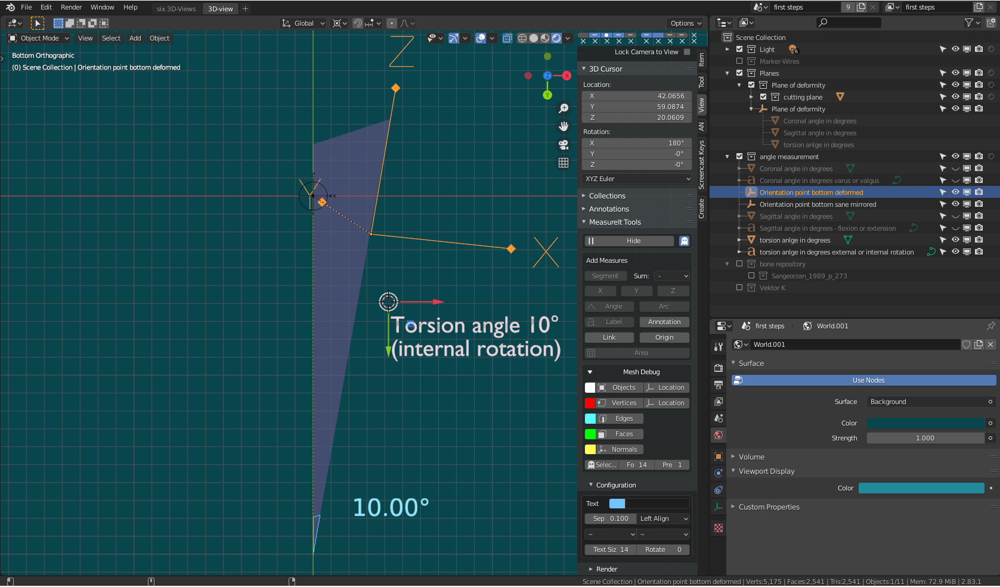

# OP-Planning steps
For a new case, the OP-Planning comprises the following steps:  
* [Insert sane and deformed bone in the measure and cut template](#Insert-sane-and-deformed-bone-in-the-measure-and-cut-template)  
* [Measure deformed bone angles](#Measure-deformed-bone-angles)  
* [Calculation of the cutting plane](#Calculation-of-the-cutting-plane)  
* [Virtual cut](#Cut)  
* [Virtual rotation](#Rotation)  
* [Planning of the placement of K-Wires](#Kirschner-Wire-planning)  
* [Planning of a cutting guide](#Planning-of-a-cutting-guide)  

# Insert sane and deformed bone in the measure and cut template  

Load and open the measure and cut template from:  
[Measure_and_Cut_Template_a00.blend](../static/images/measure_and_cut/Measure_and_Cut_Template_a00.blend)  

In the outliner:  

* Select the `bone repository` Collection  

In the main menue select  
 
* `File -> Append...` Choose a library.blend file with the bones  
* Choose the collection where the bones are stored  
* append the collection  

You will find the new bone collection in the bone repository collection.

# Measure deformed bone angles  

Load and open the measure angles example file:  

[Sangeorzan_a1.blend](../static/images/measure_angles/Sangeorzan_a1.blend)  

In the Outliner  

Only the `Light` and `bone` repository collections are activated
  

    

## Match the distal end of the deformed bone with the distal end of the sane bone  

The proximal parts of the bones match in the example. The coronal plane already matches the Blender Right Orthographic view. The plane of deformity empty has to be moved upwards 19.9862 units along the Z-Axis into the center of deformity:  
During OP Planning you can match the proximal parts with the same commands as described in [Match the distal ends of the bones](#Match-the-distal-ends-of-the-bones)  

### Apply bone transformations  
Be sure to apply the transformation for the sane and deformed bones repectively with `Strg+A -> Apply all transforms` after choosing each bone with 'RMB'. The Rotation, Location values are set to 0 and the Scale Values are set to 0. With 'Alt+G' (Translation), 'Alt+R' (Rotation) you can always restore the stored '0' position. This reset will be necessary for the angle measurement.

### Transformation orientation and Pivot Point setting  
* Use the Transformation orientation and Pivot Point settings to easily match the bones. For rotation transforms it might be good to place the cursor in the origin of the center of deformity and use `Global` Transformation orientation and `3D Cursor` as Pivot Point.  
 

## Match the distal ends of the bones  

* Select the deformed bone  
* Use the Shortcuts `G+X`, `Y`, `Z` to translate and `R+X`, `Y`, `Z` to rotate the bone.  
* Change between the views with the Numeric Keys of the Numpad: (If you don't have a numpad you can emulate one in `Edit -> Preferences -> Input -> Emulate Numpad`)  

 `1`: Sagittal front  
 `Strg+1` Sagittal back  
 `3`: Coronal front  
 `Strg+3` Coronal back  
 `7`: Transverse Top  
 `Strg+7`: Transverse Bottom  
 
 You can also enter the Values in the Item Menue. Enter the Transform Location: X, Y, Z and Rotation X, Y, Z of the screencopy:

  

   

Or download the file:

[Sangeorzan_a2.blend](../static/images/measure_angles/Sangeorzan_a2.blend)   

## Parent the Orientation Point Empties  

In the Outliner:  
 
* Activate the angle measurement Collection  
* Select the empty "Orientation point bottom deformed" 

With the Cursor in the 3D View: 

* `G+Z` Move the empty along the Z axis  until the origin touches the distal bone surface 
* Be sure, that the local coordinates of `Orientation point bottom deformed` and `Orientation point bottom sane mirrored` match with the directions of the global coordinate system.
* Select `Orientation point bottom sane mirrored` with `RMB` and then `Orientation point bottom deformed` with `Shift+RMB`. With `Strg+C -> copy location` and `Strg+C -> copy rotation` you can set the location of `Orientation point bottom sane mirrored` to the position of `Orientation point bottom deformed`  
* Select `Orientation point bottom deformed` and with `Shift+RMB` add  `deformed left` to the selection  
 
Parent the empty with the deformed bone  
   
* `Strg+P` -> Object (Keep Transform)  

## Match the proximal part of the bones with Clear Location and Rotation  

In the outliner:  

*  With `LMB` select `deformed left`.  
* **Important**: The empty "Orientation point bottom deformed" is now **deselected**.  

With the Cursor in the 3D View:  
* Type `Alt+G` and `Alt+R` to reset the Transformation to match the proximal part of the bones. 

The empty `Orientation point bottom deformed` moves with the distal part of the deformed bone and can be used for the exact angle measurement.  

### Define the position of the `Plane of deformity`  
The horizontal position of the plane of deformity (Global Z Coordinate) could be determined visually at the pont of maximum bend of the deformed bone.    
In the outliner  
* Select `Plane of deformity` mesh
* Enter 19.9862 in `Item -> Location -> Z`

  

this situation can be downloaded from:

[Sangeorzan_a3.blend](../static/images/measure_angles/Sangeorzan_a3.blend)  

## Measure the input angles

The Blender [MeasureIt Add-on](https://docs.blender.org/manual/en/2.83/addons/3d_view/measureit.html) must be activated for the next steps. 

### Measure the Coronal Angle C   
* `Numpad+3`    
* deactivate the `bone` repository collection  
* Select the Mesh `Coronal angle in degrees`  
* Change in Edit Mode with `Tab`  
* Select the lower right vertice of the measurement triangle with `RMB`.  
* `G+Mouse` Move the vertice so that the connection line between the vertice and the upper edge of the triangle crosses the origin of the `Orientation point bottom deformed` empty.  By scrolling the Middle Mouse Wheel you can enlarge the empty to get an exact match.  
* with `Shift+RMB` additionally select the upper triangle vertice and the left triangle vertice.
* In the view menu open MeasureIt Tools Panel and choose the `Angle` button.  
* In the `MeasureIt Tools` Panel choose the `Show` button.  
The angle of the triangle is shown in the 3D-View. It should be about 13° and is used as input value for the calculation of the Osteotomy angles. You might want to edit the color, size and position of the measurement in `Item -> MeasureIt Tools -> Items -> Advanced Options`. To see this option, the triangle mesh has to be selected. 
* Choose the text `Coronal angle in degrees varus or valgus` with the `RMB` in the 3D-view. Change into `Edit Mode` with `Tab`. Edit the text and leave `Edit Mode` with `Tab`.

    

### Measure the Sagittal Angle S  

* `Numpad+Strg+1` 
* Hide the Mesh `Coronal angle in degrees` with `h`.   
* Select the Mesh `Sagittal angle in degrees`  
* Change in Edit Mode with `Tab`  
* Select the lower right vertice of the measurement triangle with `RMB`.  
* `G+Mouse` Move the vertice so that the connection line between the vertice and the upper edge of the triangle crosses the origin of the `Orientation point bottom deformed` empty.  By scrolling the Middle Mouse Wheel you can enlarge the empty to get an exact match.   

(If the angle measurement does not already appear in the 3D-view:  

* with `Shift+RMB` additionally select the upper triangle vertice and the left triangle vertice.
* In the view menu open MeasureIt Tools Panel and choose the `Angle` button.  
* In the `MeasureIt Tools` Panel choose the `Show` button. )  

The angle of the triangle is shown in the 3D-View. It should be about 19° and is used as input value for the calculation of the Osteotomy angles.  
* Choose the text `Sagittal angle in degrees - flexion or extension` with the `RMB` in the 3D-view. Change into `Edit Mode` with `Tab`. Edit the text and leave `Edit Mode` with `Tab`.  

   

### Measure the Torsion Angle T 

* `Numpad+Strg+7` 
* Hide the Mesh `Sagittal angle in degrees` with `h`.   
* Select the Mesh `torsion angle in degrees`  
* In `Properties -> Object Constraints Properties` delete the `Copy Location` Constraint by clicking the 'X' with `LMB`
* `Strg+M+x + Return` mirror the triangle along the X-axis.
* `G+y` move the triangle along the Y-axis until the origin of the triangle is placed in the extension of the z-axis of the `Orientation point bottom deformed`.   
* Change in Edit Mode with `Tab`  
* Select the upper right vertice of the measurement triangle with `RMB`.  
* `G+Mouse` Move the vertice so that the connection line between the vertice and the origin of the triangle is parallel to the Z-axis of the `Orientation point bottom deformed` empty.  Repeat the translation and rotation steps, until the line between the vertice and the origin of the triangle and the Z-axis of the `Orientation point bottom deformed` empty match exactly.

By scrolling the Middle Mouse Wheel you can enlarge the empty to get an exact match.   

(If the angle measurement does not already appear in the 3D-view:  

* with `Shift+RMB` additionally select the upper triangle vertice and the left triangle vertice.
* In the view menu open `MeasureIt Tools` Panel and choose the `Angle` button.  
* In the `MeasureIt Tools` Panel choose the `Show` button. )  

The angle of the triangle is shown in the 3D-View. It should be about 10° and is used as input value for the calculation of the Osteotomy angles.  
* Choose the text `torsion anlge in degrees external or internal rotation` with the `RMB` in the 3D-view. Change into `Edit Mode` with `Tab`. Edit the text and leave `Edit Mode` with `Tab`.  
  
     

    

All necessary input angles for the calculation are now now determined. 