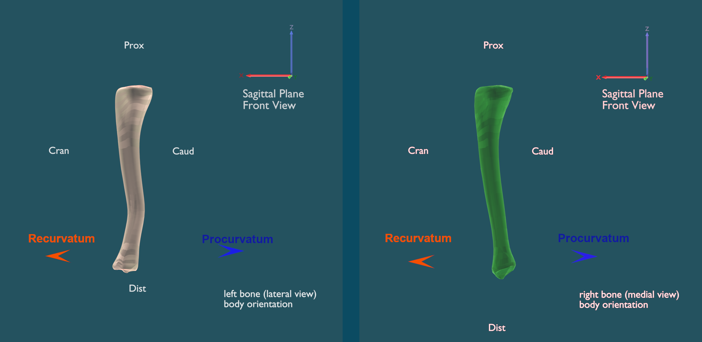
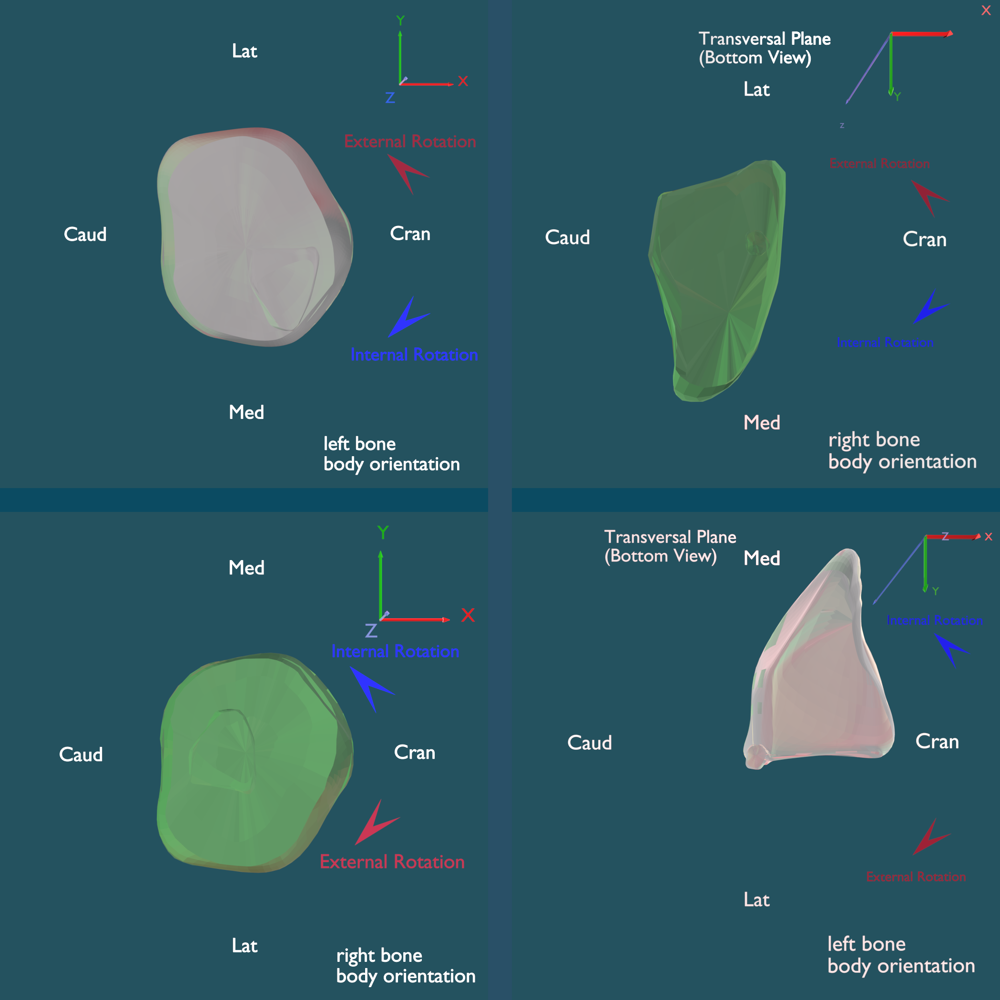
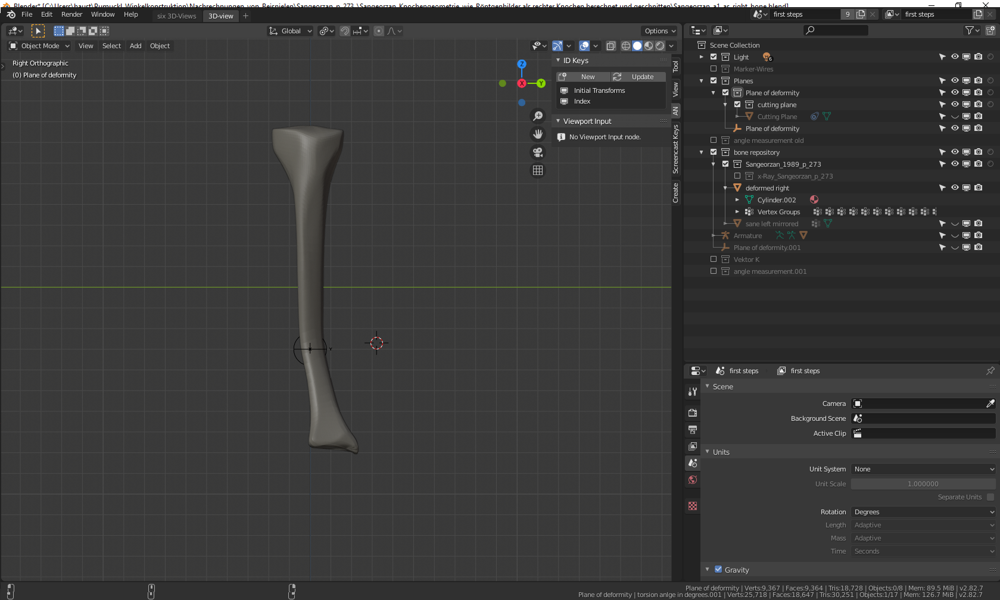

the signs of the angles could be determined with the following table:

In the following sign definition examples, the green bone represents the sane tibia (right side of the body). The white left side of the body tibia is bent according to the example of sangeorzan:
 * Coronal plane: Varus (positive sign for C = 13 degrees)
 * Sagittal plane: Extension (negative sign for S = -19 degrees)
 * Transverse plane: Internal rotation (positive sign for T = 10 degrees)

### Coronal Front sign definitions

### Sagittal Front sign definitions

### Transverse sign definitions

The application of the calculation results must follow these guidelines:

### Sign rule for angle Phi
* Start from the coronal plane (0°). From there the positive rotation is defined in **lateral** direction [Sean E. Nork, webinar 23:20](#ref-3).

As a consequence of this rule, the sign of Phi and Beta of the calculation result is correct for the left side of the body bones and changes for the right side of the body bones.

>Left side of the body bone:
>>For the rotation of the cutting plane, the sign rule for angle Phi (Rotation Z) and Beta (Local Rotation Z around Vector k) results in a positive rotation around the Z-axis in the plane of no deformity coordinate system (C1) which is chosen according to [Sangeorzan (Biomech) 1989](#ref-2) Fig. 3.

>Right side of the body bone:
>>For the rotation of the cutting plane, the sign rule for angle Phi and Beta results in a negative rotation around the Z-axis in the plane of no deformity coordinate system (C1) which is chosen according to [Sangeorzan (Biomech) 1989](#ref-2) Fig. 3.
>>Therefore the calculation result values for angle Phi and Beta must be entered with inverse sign into the blender templates for right side of the body bones.
> See [Sangeorzan Example for the right side of the body](#Sangeorzan-Example-for-the-right-side-of-the-body)

The Theta rotation axis is the Y-axis of the C1 coordinate system which has been rotated laterally around Phi. The sign of the Theta calculation result correlates with the positive rotation direction of Y in the laterally rotated C1. Therefore the sign is independent from the side of the body and the Theta sign can be entered unaltered in the blender Osteotomy templates (Rotation Y).

Rotating the distal segment by Beta around vector k compensates bone deflection and torsion. [Dobbe, Med Biol Eng Comput (2011), Fig 2](#ref-4).

# Sangeorzan Example for the right side of the body  
By mirrowing the sane and deformed bones along the y-Axis the Sangeorzan example becomes a template for a bone from the right side of the body, where the signs of Phi and Beta have to be entered with changed signs.  
Separate from the sign change, the measurements and the cut procedures are the same as for the left side of the body.  

## links to the example .blend files for the right side of the body bone example
[Sangeorzan_a1_as_right_bone.blend](../static/rh/Sangeorzan_a1_as_right_bone.blend)  

  
  

[Sangeorzan_a2_as_right_bone.blend](../static/rh/Sangeorzan_a2_as_right_bone.blend)  

  

[Sangeorzan_a3_as_right_bone.blend](../static/rh/Sangeorzan_a3_as_right_bone.blend)   

  

[Sangeorzan_a4_as_right_bone.blend](../static/rh/Sangeorzan_a4_as_right_bone.blend)   

  

[Sangeorzan_a5_as_right_bone.blend](../static//rh/Sangeorzan_a5_as_right_bone.blend)   

   

   

# References  

## ref 1

Sangeorzan BJ, Sangeorzan BP, Hansen ST, et al: Mathematically Directed Single-Cut Osteotomy for Correction of Tibial Malunion. J Orthop Trauma 3:267-275, 1989.

## ref 2

Sangeorzan BJ, Judd RP, Sangeorzan BJ: Mathematical Analysis of Single-cut Osteotomy of Complex Long Bone Deformity. J Biomech 22:1271-1278, 1989. 

## ref 3  

Sean E. Nork, tibial Malunions, Oblique Osteotomy for Corrections of Diaphyseal Multiplanar Deformities, Aotrauma North America Webinar, McGill Division of Orthopaedic Surgery, Shriners Hospitals for Children, 2020

## ref 4  

Dobbe JG, Pre KJ, Kloen P, et al: Computer-assisted and patient-specific 3-D planning and evaluation of a single-cut rotational Osteotomy for complex long-bone deformities. Med Biol Eng Comput 49:1363-1370, 2011.

## ref 5  

J. G. G. Dobbe, K. J. du Pre´, L. Blankevoort, G. J. Streekstra, P. Kloen: Computer-assisted oblique single-cut rotation osteotomy to reduce a multidirectional tibia deformity: case report Strat Traum Limb Recon (2017) 12:115-120

