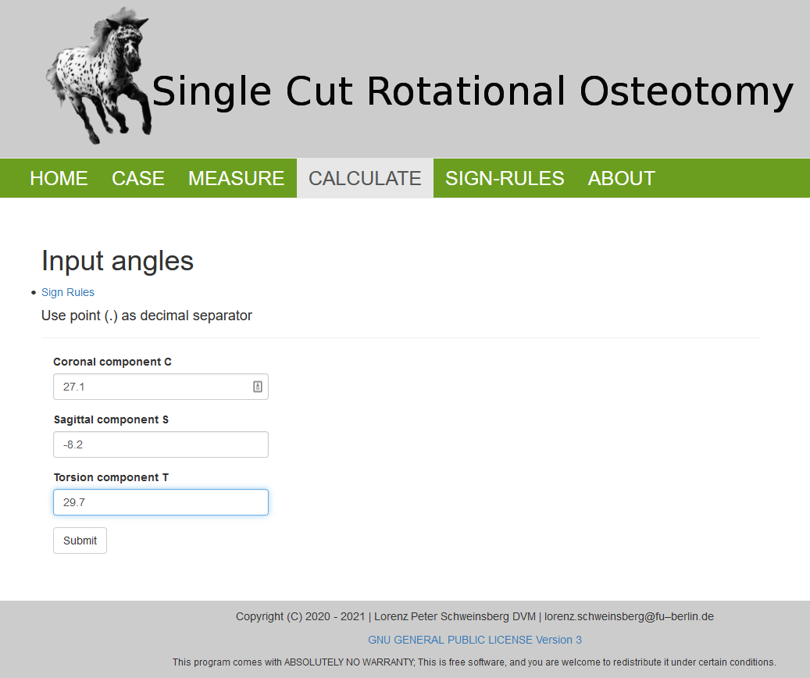
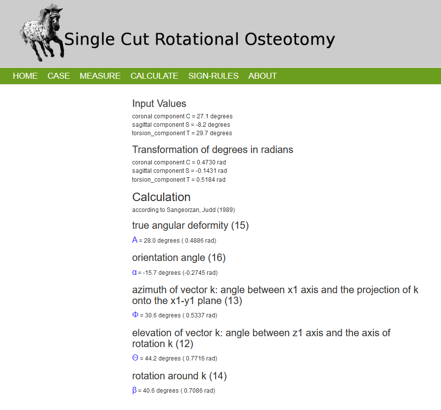
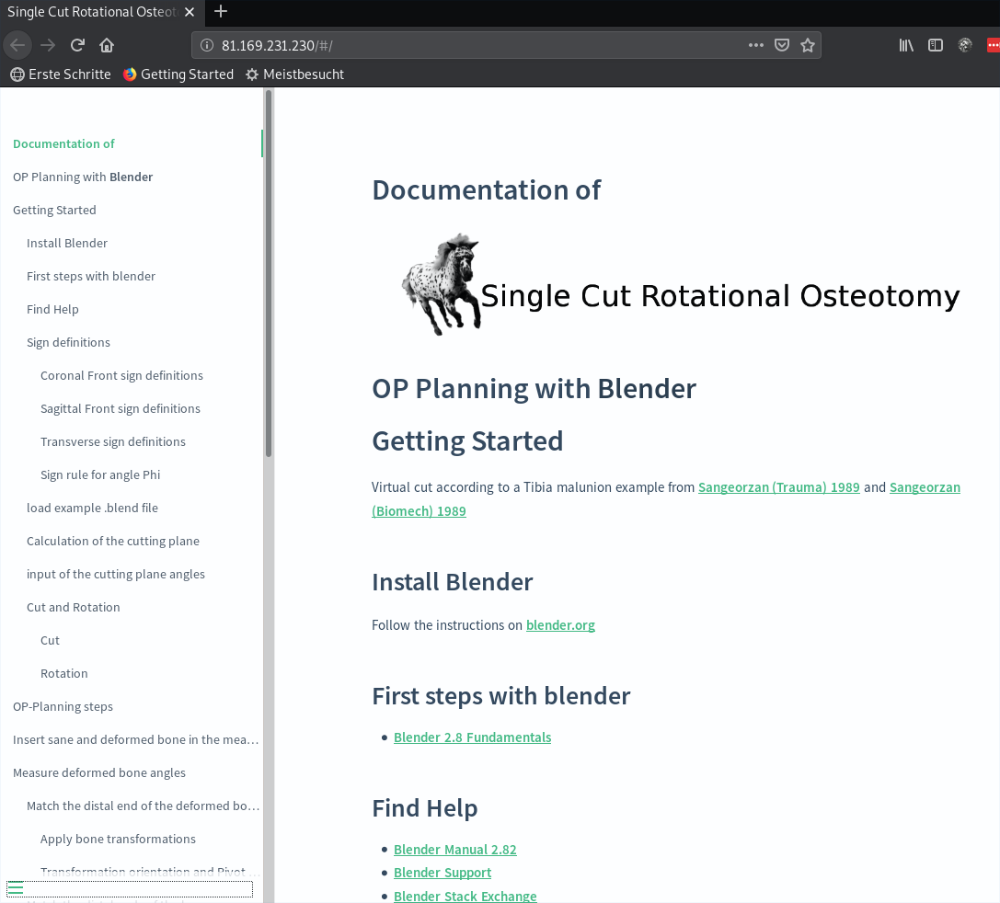

# Osteotomy_web
Osteotomy_calc is a veterinary surgeon OP planning tool, written in Python by Uwe Schweinsberg.
The web-version of Osteotomy_web is embedded in the Flask web framework and forked from 
[microblog](https://github.com/miguelgrinberg/microblog).  
A detailed documentation explains OP-Planning with Blender. Planning templates of examples are provided for download.
A forum can be used for exchange of ideas and suggestions.  

# License
The program code and documentation is licensed under GNU GENERAL PUBLIC LICENSE Version 3.

# Deployment  
The source code is already accessible via a [github repository](https://github.com/butayama/osteotomy_web).  
 
After release of the <b> Pumuckel case report </b>, by Lorenz Schweinsberg, the site shall be deployed on a debian server.  

NGINX is used as HTTP server, reverse proxy and IMAP/POP3 proxy server.  

The application is deployed with Gunicorn, a Python WSGI HTTP Server for UNIX. 

Password protected test versions of the [Osteotomy](http://Osteotomy.de) and the [Documentation](http://81.169.231.230)
website are already online.
Locally the *documentation* is stored as git Project on 
hp-P8: E:\GitHub\Osteotomy-OP-planning-with-Blender  

Archived with FreeFileSync on Seagate_4T at:  
F:\Osteotomy-OP-planning-with-Blender

# The web framework Flask
[Project Homepage](https://flask.palletsprojects.com/en/1.1.x/).
Tutorials used: 'O'Reilly book [Flask Web Development](http://www.flaskbook.com) by Miguel Grinberg  
and the [Flask Mega-Tutorial](https://blog.miguelgrinberg.com/post/the-flask-mega-tutorial-part-i-hello-world).    

Flask is writen in Python and licensed under BSD License

# Structure of Osteotomy_web  
  

# Calculation result
  

# Documentation of OP-Planning with [Blender](https://www.blender.org/)  
The documentation is rendered with [docsify](https://docsify.js.org/#/).  
  
  

[Blender](https://www.blender.org/) is a 3D creation suite. It is used for angle measurement 
of 3D bone models and virtual OP procedures. 

## Authentication and security
   * Flask-Login: Management of user sessions for logged-in users  
   * Werkzeug: Password hashing and verification
   * itsdangerous: Cryptographically secure token generation and verification
   * assignment of user roles according to permissions in a Flask-SQLAlchemy (MySQL) database.
   * Forms are protected against CSRF with a form.hidden_tag() element and secret key.
   * The secret key is stored in an environment variable.
   * Secure https connection with valid certificate (test-version: Let's Encrypt)  
   
# Testing  
   * 35 test modules achieve a coverage of 62%.   
   
# ToDo  
   * Integration of the documentation into osteotomy_web.
   * A cookie confirmation info still has to be implemented.  
   
# Docker deploy

## Installation von docker
Achtung, Fehler bei Installation von docker über Snap. Siehe meinen Kommentar in stack overflow:
https://stackoverflow.com/questions/51729836/error-response-from-daemon-cannot-stop-container/64120350#64120350
   
# after changes: create a new image
 docker build -t yetigo/osteotomy:latest .  
 docker build -t yetigo/osteotomytool:1.0.1 .  
 
# test the new image locally   
 docker run --name pum -d -p 8000:5000 --rm yetigo/osteotomy:latest  
 docker run --name pum -d -p 8000:5000 --rm yetigo/osteotomytool:1.0.1  
 
# upload docker container image  
 docker push yetigo/osteotomy:latest  
 docker push yetigo/osteotomytool:1.0.1

# download docker container image 
 docker pull yetigo/osteotomy:latest  
 docker pull yetigo/osteotomytool:1.0.0  
 docker run --name pum -d -p 8000:5000 --rm yetigo/osteotomy:latest   
 docker run --name pum -d -p 8000:5000 --rm yetigo/osteotomytool:1.0.0
 
# deploy on server: download docker SSL container image 
# in Windows PowerShell (sollte auch im Linux Terminal funktionieren):  
 ssh uwe@85.214.33.21
 password:**********
 docker pull yetigo/osteotomy_ssl:latest    
 docker run --restart=always -v //etc/ssl/certs:/ssl/private -d --name pum yetigo/osteotomy_ssl:latest 

# display active containers 
 docker ps  
 docker container ls  
 
# stop Container:
docker container stop pum   

# remove all docker containers 
docker rm $(docker ps -a -q)

# remove Container:
docker container rm pum  

# display Images:
docker images

# remove Image:
docker image rmi yetigo/osteotomy:latest

# remove all docker images 
docker rmi $(docker images -q)

# debugging docker run -> exit
source: https://stackoverflow.com/questions/38112968/how-to-know-the-reason-why-a-docker-container-exits  
docker logs $container_id / docker logs pum
docker inspect $container_id / docker inspect pum

Alpine linux:
docker exec -it <container> /bin/sh

