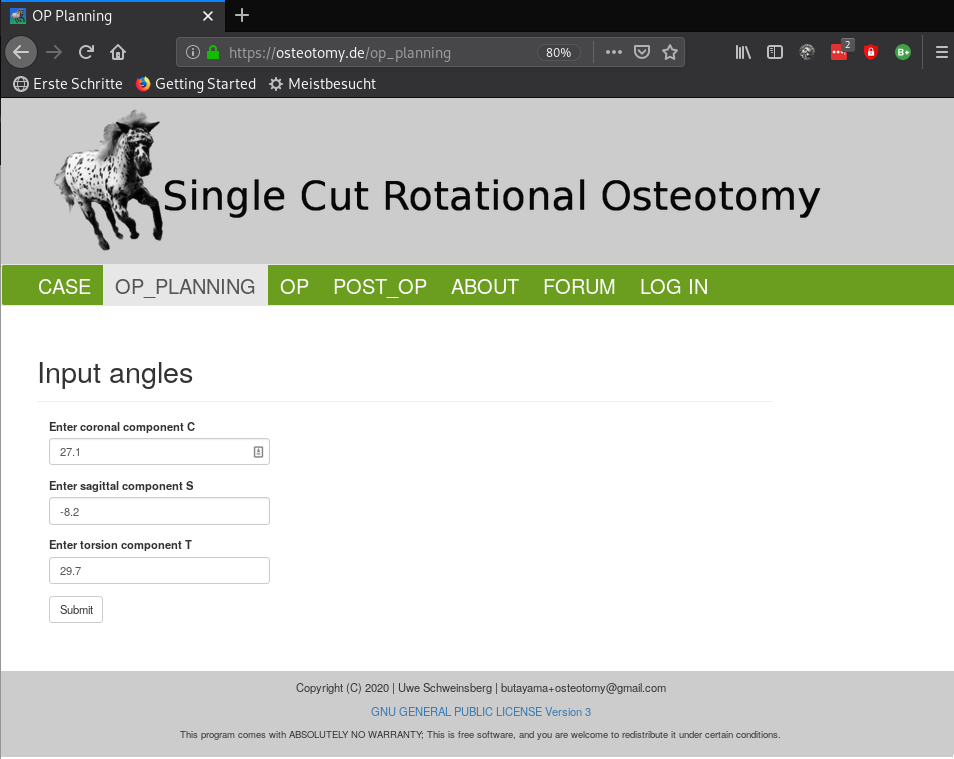
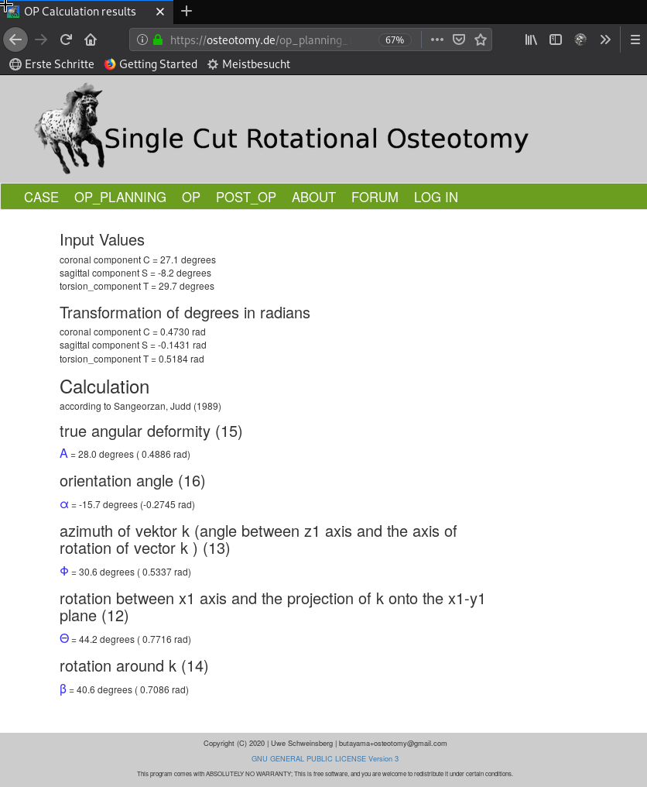
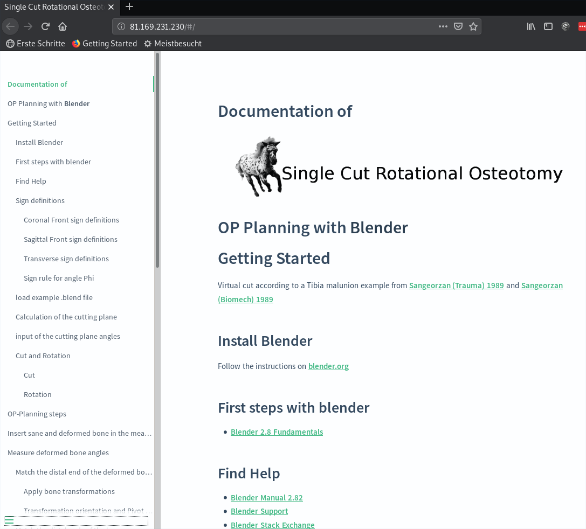

# Osteotomy_web
Osteotomy_calc is a veterinary surgeon OP planning tool, written in Python by Uwe Schweinsberg.
The web-version of Osteotomy_web is embedded in the Flask web framework and forked from 
[microblog](https://github.com/miguelgrinberg/microblog).  
A detailed documentation explains OP-Planning with Blender. Planning templates of examples are provided for download.
A forum can be used for exchange of ideas and suggestions.  

# License
The program code and documentation is licensed under GNU GENERAL PUBLIC LICENSE Version 3.

# Deployment  
The source code is already accessible via a [github repository](https://github.com/butayama/osteotomy_web).  
 
After release of the <b> Pumuckel case report </b>, by Lorenz Schweinsberg, the site shall be deployed on a debian server.  

NGINX is used as HTTP server, reverse proxy and IMAP/POP3 proxy server.  

The application is deployed with Gunicorn, a Python WSGI HTTP Server for UNIX. 

Password protected test versions of the [Osteotomy](http://Osteotomy.de) and the [Documentation](http://81.169.231.230)
website are already online.

# The web framework Flask
[Project Homepage](https://flask.palletsprojects.com/en/1.1.x/).
Tutorials used: 'O'Reilly book [Flask Web Development](http://www.flaskbook.com) by Miguel Grinberg  
and the [Flask Mega-Tutorial](https://blog.miguelgrinberg.com/post/the-flask-mega-tutorial-part-i-hello-world).    

Flask is writen in Python and licensed under BSD License

# Structure of Osteotomy_web  
  

# Calculation result
  

# Documentation of OP-Planning with [Blender](https://www.blender.org/)  
The documentation is rendered with [docsify](https://docsify.js.org/#/).  
  
  

[Blender](https://www.blender.org/) is a 3D creation suite. It is used for angle measurement 
of 3D bone models and virtual OP procedures. 

## Authentication and security
   * Flask-Login: Management of user sessions for logged-in users  
   * Werkzeug: Password hashing and verification
   * itsdangerous: Cryptographically secure token generation and verification
   * assignment of user roles according to permissions in a Flask-SQLAlchemy (MySQL) database.
   * Forms are protected against CSRF with a form.hidden_tag() element and secret key.
   * The secret key is stored in an environment variable.
   * Secure https connection with valid certificate (test-version: Let's Encrypt)  
   
# Testing  
   * 35 test modules achieve a coverage of 62%.   
   
# ToDo  
   * Integration of the documentation into osteotomy_web.
   * A cookie confirmation info still has to be implemented.  