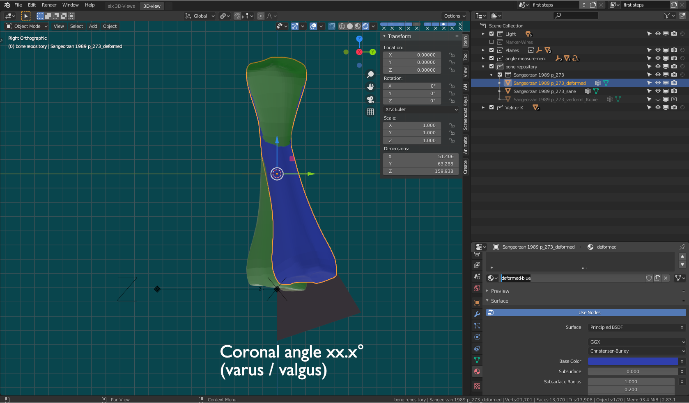
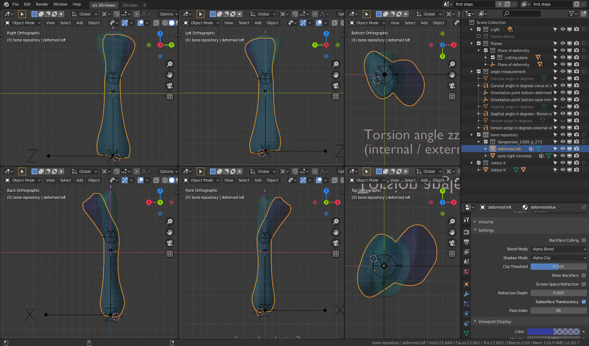
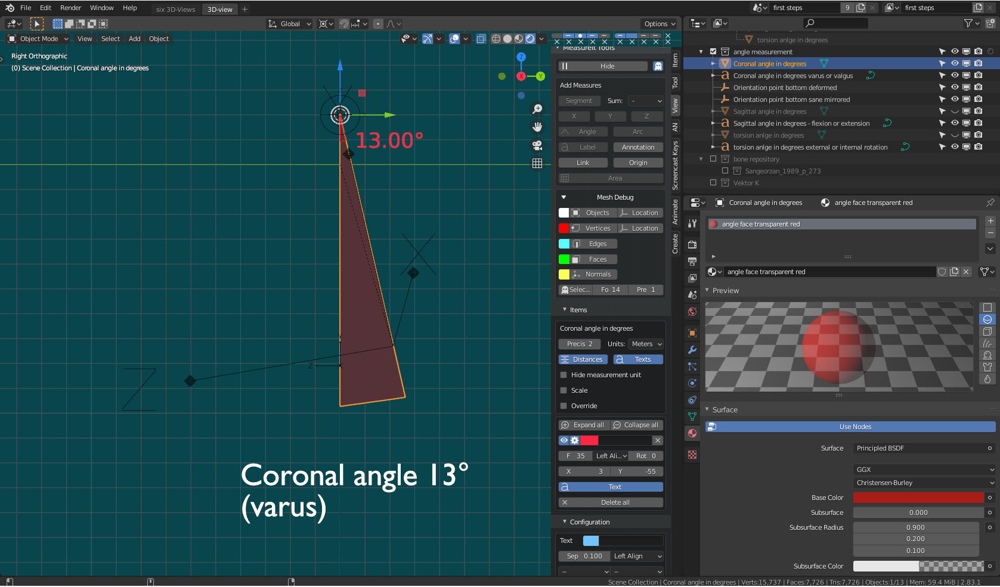
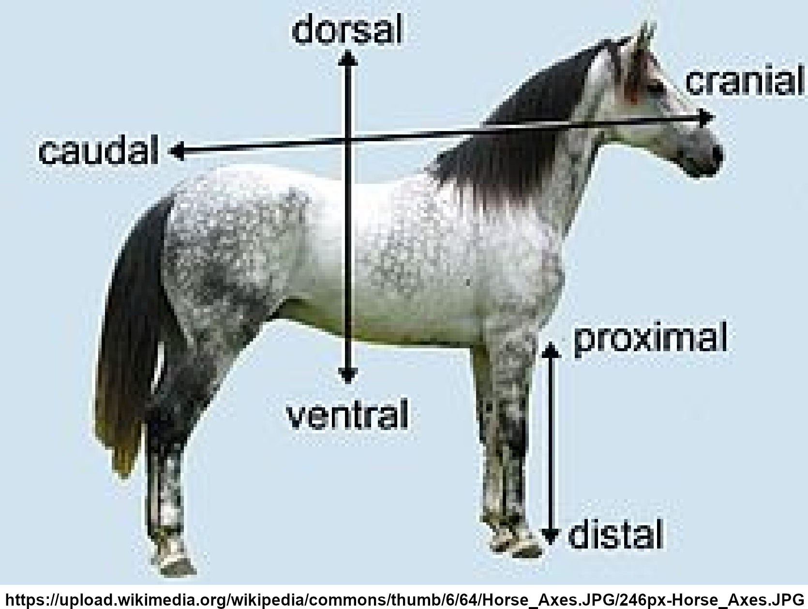

title: Post Number 1
subtitle: This is the first post
category: Python
published: May 3, 2020
image: placeholder.jpg

# Documentation of

# OP Planning with **Blender**  

# Getting Started  

Virtual cut according to a Tibia malunion example from [Sangeorzan (Trauma) 1989](#ref-1) and [Sangeorzan (Biomech) 1989](#ref-2)  

## Install Blender  

Follow the instructions on [blender.org](https://www.blender.org/download/)  

## First steps with blender  

*  [Blender 2.8 Fundamentals](https://www.youtube.com/watch?v=MF1qEhBSfq4&list=PLa1F2ddGya_-UvuAqHAksYnB0qL9yWDO6)  

## Find Help  

* [Blender Manual 2.82](https://docs.blender.org/manual/en/2.82/)
* [Blender Support](https://www.blender.org/support/)
* [Blender Stack Exchange](https://blender.stackexchange.com/)  

## Sign definitions  

the signs of the angles could be determined with the following table:  
  

In the following sign definition examples, the green bone represents the sane tibia (right side of the body). The white left side of the body tibia is bent according to the example of sangeorzan:  
 * Coronal plane: Varus (positive sign for C = 13 degrees)  
 * Sagittal plane: Extension (negative sign for S = -19 degrees)  
 * Transverse plane: Internal rotation (positive sign for T = 10 degrees)     
  
### Coronal Front sign definitions  
  

### Sagittal Front sign definitions  
  

### Transverse sign definitions  
  

The application of the calculation results must follow these guidelines:  

### Sign rule for angle Phi  
* Start from the coronal plane (0°). From there the positive rotation is defined in **lateral** direction [Sean E. Nork, webinar 23:20](#ref-3).

As a consequence of this rule, the sign of Phi and Beta of the calculation result is correct for the left side of the body bones and changes for the right side of the body bones.

>Left side of the body bone:  
>>For the rotation of the cutting plane, the sign rule for angle Phi (Rotation Z) and Beta (Local Rotation Z around Vector k) results in a positive rotation around the Z-axis in the plane of no deformity coordinate system (C1) which is chosen according to [Sangeorzan (Biomech) 1989](#ref-2) Fig. 3. 

>Right side of the body bone: 
>>For the rotation of the cutting plane, the sign rule for angle Phi and Beta results in a negative rotation around the Z-axis in the plane of no deformity coordinate system (C1) which is chosen according to [Sangeorzan (Biomech) 1989](#ref-2) Fig. 3.  
>>Therefore the calculation result values for angle Phi and Beta must be entered with inverse sign into the blender templates for right side of the body bones. 
> See [Sangeorzan Example for the right side of the body](#Sangeorzan-Example-for-the-right-side-of-the-body)

The Theta rotation axis is the Y-axis of the C1 coordinate system which has been rotated laterally around Phi. The sign of the Theta calculation result correlates with the positive rotation direction of Y in the laterally rotated C1. Therefore the sign is independent from the side of the body and the Theta sign can be entered unaltered in the blender Osteotomy templates (Rotation Y).

Rotating the distal segment by Beta around vector k compensates bone deflection and torsion. [Dobbe, Med Biol Eng Comput (2011), Fig 2](#ref-4).   

The calculation is made on [Osteotomy.de](https://osteotomy.de/)  
  

 
## load example .blend file
download [Sangeorzan_a1.blend](http://81.169.231.230/home/uwe/osteotomy_op_planning/docs/templates/a1/Sangeorzan_a1.blend)  
Open the file Sangeorzan_a1.blend in blender.  

Angle measurements in the corresponding plane are shown.  
Deformed left bone: white. 
Sane right bone: green. 

Angle measurements in the corresponding plane are shown (with hidden bones).  
  
For a detailed description of angle measurement see: [Measure deformed bone angles](#Measure-deformed-bone-angles)

## Calculation of the cutting plane  
The open source tool for [Calculation of the cutting angles according to Sangeorzan](#Calculation-of-the-cutting-angles-according-to-Sangeorzan) can be found at [Osteotomy.de](https://osteotomy.de/)   

## input of the cutting plane angles
* Activate the `3D-view` workspace  

In the outliner:  
* Hide the sane left mirrored bone  
* Deactivate the `angle measurement` collection  
* select the `Planes` collection with Plane of deformity and the cutting plane collection
* select the mesh "Plane of deformity" by left mouse clicking (`LMB`) on the item in the outliner

With the cursor in the 3D view  
* set the Right Orthographic (coronal) view by typing `numpad+3`  
* type `N` to display the `Item` with `Location` and `Rotation` values of the cutting plane

These adjustments can be found in  
[Sangeorzan_a2.blend](https://github.com/butayama/Osteotomy-OP-planning-with-Blender/blob/master/docs/templates/a2/Sangeorzan_a2.blend)  
  

Input the values for Phi  in `Rotation Z` and Theta in `Rotation Y`  

These adjustments can be found in  
[Sangeorzan_a3.blend](https://github.com/butayama/Osteotomy-OP-planning-with-Blender/blob/master/docs/templates/a3/Sangeorzan_a3.blend)  
  

## Cut and Rotation  
 
### Cut  
* select Sangeorzan 1989 p_273_deformed with `RMB`
* In the Properties Window (bottom right ) select `Modifier Properties` (click on the wrench symbol)
* `Add Modifier -> Boolean` (third from Top in the Generate column)   

In the Boolean Modifier menue:  
* In the Object `drop down list` choose `cutting plane as mesh object` to use for Boolean operation. 
* Press `Apply` Button  
  
In the 3D-view:  
* select Sangeorzan 1989 p_273_deformed with `RMB`  
* change into Edit Mode with the `Tab` key  
* select a vertice in the lower bone (under the cutting plane)  
* Press `Strg+L` to select all lower bone vertices  
* Press `P -> Selection` to separate the lower from the upper bone mesh  
* change into Object Mode with the `Tab` key  
* select the lower bone Sangeorzan 1989 p_273_deformed.001 with `RMB`  

This situation is stored in:   
[Sangeorzan_a4.blend](https://github.com/butayama/Osteotomy-OP-planning-with-Blender/blob/master/docs/templates/a4/Sangeorzan_a4.blend)  
   

### Rotation

* select the lower bone Sangeorzan 1989 p_273_deformed.001 with `RMB 
* add Vekto K with `Shift RMB` to the selection  
* parent the bone to Vektor K with `Ctrl+P -> Object (Keep transform)`   
* select Vektor K with `RMB`  
* Rotate with Mouse movement after `R+Z+Z` (Rotate around the local Z axis) 
* Stop rotation with `LMB` and enter the Value with opposite sign for beta into the Angle field of the Rotate Pop-up menue in the left bottom of the 3D-view.  

This situation is stored in:   
[Sangeorzan_a5.blend](https://github.com/butayama/Osteotomy-OP-planning-with-Blender/blob/master/docs/templates/a5/Sangeorzan_a5.blend)  

The comparison between deformed right bone (white) and the sane left bone green after cut and rotation:  
  
This is the end of the [getting started](#Getting-Started) example.  

# OP-Planning steps
For a new case, the OP-Planning comprises the following steps:  
* [Insert sane and deformed bone in the measure and cut template](#Insert-sane-and-deformed-bone-in-the-measure-and-cut-template)  
* [Measure deformed bone angles](#Measure-deformed-bone-angles)  
* [Calculation of the cutting plane](#Calculation-of-the-cutting-plane)  
* [Virtual cut](#Cut)  
* [Virtual rotation](#Rotation)  
* [Planning of the placement of K-Wires](#Kirschner-Wire-planning)  
* [Planning of a cutting guide](#Planning-of-a-cutting-guide)  

# Insert sane and deformed bone in the measure and cut template  

Load and open the measure and cut template from:  
[Measure_and_Cut_Template_a00.blend](https://github.com/butayama/Osteotomy-OP-planning-with-Blender/blob/master/docs/templates/measure_and_cut/Measure_and_Cut_Template_a00.blend)  

In the outliner:  

* Select the `bone repository` Collection  

In the main menue select  
 
* `File -> Append...` Choose a library.blend file with the bones  
* Choose the collection where the bones are stored  
* append the collection  

You will find the new bone collection in the bone repository collection.

# Measure deformed bone angles  

Load and open the measure angles example file:  

[Sangeorzan_a1.blend](https://github.com/butayama/Osteotomy-OP-planning-with-Blender/blob/master/docs/templates/measure_angles/Sangeorzan_a1.blend)  

In the Outliner  

Only the `Light` and `bone` repository collections are activated
  

    

## Match the distal end of the deformed bone with the distal end of the sane bone  

The proximal parts of the bones match in the example. The coronal plane already matches the Blender Right Orthographic view. The plane of deformity empty has to be moved upwards 19.9862 units along the Z-Axis into the center of deformity:  
During OP Planning you can match the proximal parts with the same commands as described in [Match the distal ends of the bones](#Match-the-distal-ends-of-the-bones)  

### Apply bone transformations  
Be sure to apply the transformation for the sane and deformed bones repectively with `Strg+A -> Apply all transforms` after choosing each bone with 'RMB'. The Rotation, Location values are set to 0 and the Scale Values are set to 0. With 'Alt+G' (Translation), 'Alt+R' (Rotation) you can always restore the stored '0' position. This reset will be necessary for the angle measurement.

### Transformation orientation and Pivot Point setting  
* Use the Transformation orientation and Pivot Point settings to easily match the bones. For rotation transforms it might be good to place the cursor in the origin of the center of deformity and use `Global` Transformation orientation and `3D Cursor` as Pivot Point.  
 

## Match the distal ends of the bones  

* Select the deformed bone  
* Use the Shortcuts `G+X`, `Y`, `Z` to translate and `R+X`, `Y`, `Z` to rotate the bone.  
* Change between the views with the Numeric Keys of the Numpad: (If you don't have a numpad you can emulate one in `Edit -> Preferences -> Input -> Emulate Numpad`)  

 `1`: Sagittal front  
 `Strg+1` Sagittal back  
 `3`: Coronal front  
 `Strg+3` Coronal back  
 `7`: Transverse Top  
 `Strg+7`: Transverse Bottom  
 
 You can also enter the Values in the Item Menue. Enter the Transform Location: X, Y, Z and Rotation X, Y, Z of the screencopy:

  

   

Or download the file:

[Sangeorzan_a2.blend](https://github.com/butayama/Osteotomy-OP-planning-with-Blender/blob/master/docs/templates/measure_angles/Sangeorzan_a2.blend)   

## Parent the Orientation Point Empties  

In the Outliner:  
 
* Activate the angle measurement Collection  
* Select the empty "Orientation point bottom deformed" 

With the Cursor in the 3D View: 

* `G+Z` Move the empty along the Z axis  until the origin touches the distal bone surface 
* Be sure, that the local coordinates of `Orientation point bottom deformed` and `Orientation point bottom sane mirrored` match with the directions of the global coordinate system.
* Select `Orientation point bottom sane mirrored` with `RMB` and then `Orientation point bottom deformed` with `Shift+RMB`. With `Strg+C -> copy location` and `Strg+C -> copy rotation` you can set the location of `Orientation point bottom sane mirrored` to the position of `Orientation point bottom deformed`  
* Select `Orientation point bottom deformed` and with `Shift+RMB` add  `deformed left` to the selection  
 
Parent the empty with the deformed bone  
   
* `Strg+P` -> Object (Keep Transform)  

## Match the proximal part of the bones with Clear Location and Rotation  

In the outliner:  

*  With `LMB` select `deformed left`.  
* **Important**: The empty "Orientation point bottom deformed" is now **deselected**.  

With the Cursor in the 3D View:  
* Type `Alt+G` and `Alt+R` to reset the Transformation to match the proximal part of the bones. 

The empty `Orientation point bottom deformed` moves with the distal part of the deformed bone and can be used for the exact angle measurement.  

### Define the position of the `Plane of deformity`  
The horizontal position of the plane of deformity (Global Z Coordinate) could be determined visually at the pont of maximum bend of the deformed bone.    
In the outliner  
* Select `Plane of deformity` mesh
* Enter 19.9862 in `Item -> Location -> Z`

  

this situation can be downloaded from:

[Sangeorzan_a3.blend](https://github.com/butayama/Osteotomy-OP-planning-with-Blender/blob/master/docs/templates/measure_angles/Sangeorzan_a3.blend)  

## Measure the input angles

The Blender [MeasureIt Add-on](https://docs.blender.org/manual/en/2.83/addons/3d_view/measureit.html) must be activated for the next steps. 

### Measure the Coronal Angle C   
* `Numpad+3`    
* deactivate the `bone` repository collection  
* Select the Mesh `Coronal angle in degrees`  
* Change in Edit Mode with `Tab`  
* Select the lower right vertice of the measurement triangle with `RMB`.  
* `G+Mouse` Move the vertice so that the connection line between the vertice and the upper edge of the triangle crosses the origin of the `Orientation point bottom deformed` empty.  By scrolling the Middle Mouse Wheel you can enlarge the empty to get an exact match.  
* with `Shift+RMB` additionally select the upper triangle vertice and the left triangle vertice.
* In the view menu open MeasureIt Tools Panel and choose the `Angle` button.  
* In the `MeasureIt Tools` Panel choose the `Show` button.  
The angle of the triangle is shown in the 3D-View. It should be about 13° and is used as input value for the calculation of the Osteotomy angles. You might want to edit the color, size and position of the measurement in `Item -> MeasureIt Tools -> Items -> Advanced Options`. To see this option, the triangle mesh has to be selected. 
* Choose the text `Coronal angle in degrees varus or valgus` with the `RMB` in the 3D-view. Change into `Edit Mode` with `Tab`. Edit the text and leave `Edit Mode` with `Tab`.

    

### Measure the Sagittal Angle S  

* `Numpad+Strg+1` 
* Hide the Mesh `Coronal angle in degrees` with `h`.   
* Select the Mesh `Sagittal angle in degrees`  
* Change in Edit Mode with `Tab`  
* Select the lower right vertice of the measurement triangle with `RMB`.  
* `G+Mouse` Move the vertice so that the connection line between the vertice and the upper edge of the triangle crosses the origin of the `Orientation point bottom deformed` empty.  By scrolling the Middle Mouse Wheel you can enlarge the empty to get an exact match.   

(If the angle measurement does not already appear in the 3D-view:  

* with `Shift+RMB` additionally select the upper triangle vertice and the left triangle vertice.
* In the view menu open MeasureIt Tools Panel and choose the `Angle` button.  
* In the `MeasureIt Tools` Panel choose the `Show` button. )  

The angle of the triangle is shown in the 3D-View. It should be about 19° and is used as input value for the calculation of the Osteotomy angles.  
* Choose the text `Sagittal angle in degrees - flexion or extension` with the `RMB` in the 3D-view. Change into `Edit Mode` with `Tab`. Edit the text and leave `Edit Mode` with `Tab`.  

   

### Measure the Torsion Angle T 

* `Numpad+Strg+7` 
* Hide the Mesh `Sagittal angle in degrees` with `h`.   
* Select the Mesh `torsion angle in degrees`  
* In `Properties -> Object Constraints Properties` delete the `Copy Location` Constraint by clicking the 'X' with `LMB`
* `Strg+M+x + Return` mirror the triangle along the X-axis.
* `G+y` move the triangle along the Y-axis until the origin of the triangle is placed in the extension of the z-axis of the `Orientation point bottom deformed`.   
* Change in Edit Mode with `Tab`  
* Select the upper right vertice of the measurement triangle with `RMB`.  
* `G+Mouse` Move the vertice so that the connection line between the vertice and the origin of the triangle is parallel to the Z-axis of the `Orientation point bottom deformed` empty.  Repeat the translation and rotation steps, until the line between the vertice and the origin of the triangle and the Z-axis of the `Orientation point bottom deformed` empty match exactly.

By scrolling the Middle Mouse Wheel you can enlarge the empty to get an exact match.   

(If the angle measurement does not already appear in the 3D-view:  

* with `Shift+RMB` additionally select the upper triangle vertice and the left triangle vertice.
* In the view menu open `MeasureIt Tools` Panel and choose the `Angle` button.  
* In the `MeasureIt Tools` Panel choose the `Show` button. )  

The angle of the triangle is shown in the 3D-View. It should be about 10° and is used as input value for the calculation of the Osteotomy angles.  
* Choose the text `torsion anlge in degrees external or internal rotation` with the `RMB` in the 3D-view. Change into `Edit Mode` with `Tab`. Edit the text and leave `Edit Mode` with `Tab`.  
  
     

    

All necessary input angles for the calculation are now now determined. The following steps are described in  [Calculation of the cutting plane](#Calculation-of-the-cutting-plane) and [Cut and Rotation](#Cut-and-Rotation)

# Kirschner Wire planning  

The positioning of the k-wires should be a result of thorough OP planning and a scheme could be achieved by using the Blender OP planning templates.  The reasonable placement of k-wires is dependent on the case under consideration.

All angles are measured from the Coronal plane (Y-axis). The positive rotation is defined in lateral direction. As a consequence of this rule, the sign of the angles of the calculation result is correct for the left side of the body bones and changes for the right side of the body bones. See: [Sign definitions](#Sign-definitions)  and [Sign rule for angle Phi](#Sign-rule-for-angle-Phi) 

The most important axis to find is the rotation axis of the cutting plane. Its position is parallel to the coronal plane (Y-axis), rotated around the starting point angle Phi. 

In the Blender template activate the `Marker-Wires` collection. The `K-wire_1 blue rotation axis cutting plane` is already parented to the cutting plane and will be in the right position after `Phi` is entered as `Rotation Z` in the Item Menu of the `Plane of deformity`empty. It always shows the direction of the local Y-axis of the `Plane of deformity`empty.  

K-wire_1 is placed in the proximal part of the bone. Along the K-wire_1 the oblique cut has to be performed with the help of a jig for angle Theta or a 3-d printed [cutting guide](#Planning-of-a-cutting-guide).  [Sean E. Nork 27:10](#ref-3) places several k-wires along the cutting plane to achieve a good obliquity.  

  

After the cut a second k-wire could be placed parallel to the cutting plane in the distal bone segment. A Beta jig can help to find the right distance from k-Wire_1. After osteotomy, the distal bone segment can be rotated about the line perpendicular to the cutting plane until K-wire 2 is parallel to K-wire 1. [Dobbe 116](#ref-5). The origin of angle Beta must be placed at the center of deformity. This center is quite difficult to predict under operation circumstances and a k-wire which is placed wrong could lead to correction errors. In any case the correction should be verified by interoperative radiographs before setting the lag screws.  

The view of maximal deformity could be found with the 'orientation angle Alpha'. It is measured from the Coronal plane (Y-axis) with the correct sign according to the [Sign rule for angle Phi](#Sign-rule-for-angle-Phi). If an additional k-wire is set in the axis of the maximal deformity view it might help to find the correct radiograph view angle for the verification of the correct OP result.  

# Planning of a cutting guide
On the ToDo List...

# Coordinate System 
## Anatomical axes (horse)

# Axes, Plane and Coordinate denominations
Right and left **bone to body** orientation
## Coronal Front

## Coronal Back

## Sagittal Front

## Sagittal Back

## Transverse Top and Transverse Bottom

# Calculation of the cutting angles according to Sangeorzan
[Osteotomy.de](https://osteotomy.de/)  

# Sangeorzan Example for the right side of the body  
By mirrowing the sane and deformed bones along the y-Axis the Sangeorzan example becomes a template for a bone from the right side of the body, where the signs of Phi and Beta have to be entered with changed signs.  
Separate from the sign change, the measurements and the cut procedures are the same as for the left side of the body.  

## links to the example .blend files for the right side of the body bone example
[Sangeorzan_a1_as_right_bone.blend](https://github.com/butayama/Osteotomy-OP-planning-with-Blender/blob/master/docs/templates/rh/Sangeorzan_a1_as_right_bone.blend)  

  
  

[Sangeorzan_a2_as_right_bone.blend](https://github.com/butayama/Osteotomy-OP-planning-with-Blender/blob/master/docs/templates/rh/Sangeorzan_a2_as_right_bone.blend)  

  

[Sangeorzan_a3_as_right_bone.blend](https://github.com/butayama/Osteotomy-OP-planning-with-Blender/blob/master/docs/templates/rh/Sangeorzan_a3_as_right_bone.blend)   

  

[Sangeorzan_a4_as_right_bone.blend](https://github.com/butayama/Osteotomy-OP-planning-with-Blender/blob/master/docs/templates/rh/Sangeorzan_a4_as_right_bone.blend)   

  

[Sangeorzan_a5_as_right_bone.blend](https://github.com/butayama/Osteotomy-OP-planning-with-Blender/blob/master/docs/templates/rh/Sangeorzan_a5_as_right_bone.blend)   

   

   

# References  

## ref 1

Sangeorzan BJ, Sangeorzan BP, Hansen ST, et al: Mathematically Directed Single-Cut Osteotomy for Correction of Tibial Malunion. J Orthop Trauma 3:267-275, 1989.

## ref 2

Sangeorzan BJ, Judd RP, Sangeorzan BJ: Mathematical Analysis of Single-cut Osteotomy of Complex Long Bone Deformity. J Biomech 22:1271-1278, 1989. 

## ref 3  

Sean E. Nork, tibial Malunions, Oblique Osteotomy for Corrections of Diaphyseal Multiplanar Deformities, Aotrauma North America Webinar, McGill Division of Orthopaedic Surgery, Shriners Hospitals for Children, 2020

## ref 4  

Dobbe JG, Pre KJ, Kloen P, et al: Computer-assisted and patient-specific 3-D planning and evaluation of a single-cut rotational Osteotomy for complex long-bone deformities. Med Biol Eng Comput 49:1363-1370, 2011.

## ref 5  

J. G. G. Dobbe, K. J. du Pre´, L. Blankevoort, G. J. Streekstra, P. Kloen: Computer-assisted oblique single-cut rotation osteotomy to reduce a multidirectional tibia deformity: case report Strat Traum Limb Recon (2017) 12:115-120

